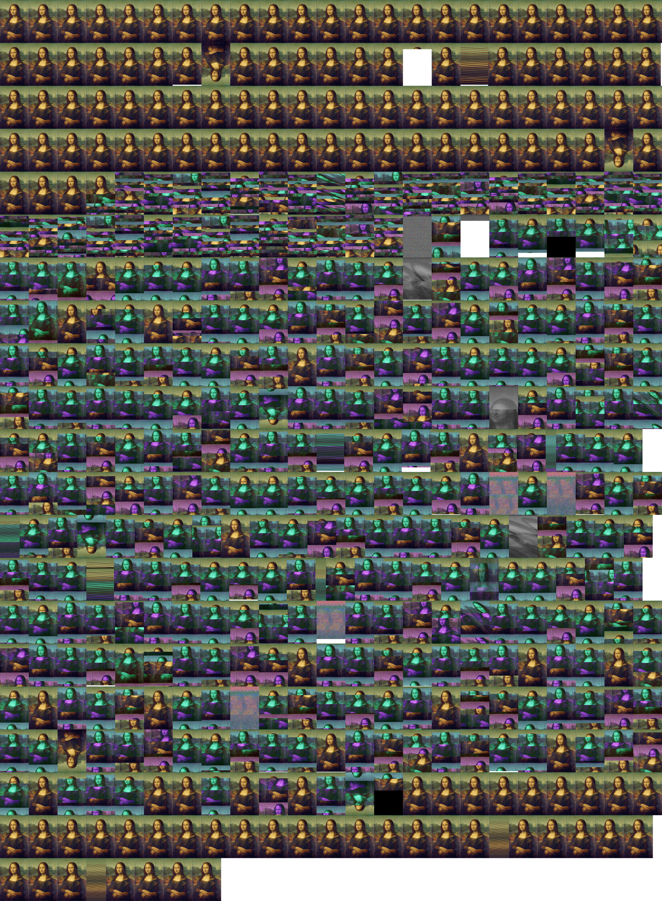

# ramrecovery

Simple demo illustrating remanence of data in RAM. See https://en.wikipedia.org/wiki/Cold_boot_attack and associated papers for much more information!  In one of the original cold boot
attack papers "Lest We Remember: Cold Boot Attacks on Encryption Keys" by Halderman et al. they loaded an image of the Mona Lisa and "cut power for varying lengths of time".

The program in src, loads many images of the Mona Lisa into RAM on the Pi, running Raspberry Pi OS Lite.

```
cd src
make run
```

Then quickly turn off/on the power on the raspberry pi.

Using the memory forensics kernel module LiME, we can see there is still some remanence of the Mona Lisa in memory:

```
git clone https://github.com/504ensicsLabs/LiME.git
cd LiME/src/
make
```

```
sudo insmod ./lime-$(uname -r).ko "path=out.dump format=padded"
```

Extract Mona Lisa images from memory dump:

```
grep --text --byte-offset --only-matching --perl-regexp '\x00\x00\x02\x00\x00\x00\x00\x00\x00\x00\x58\x02' out.dump | sed "s/:.*//g" | xargs -I {} dd if=out.dump bs=1 skip={} count=725444 of={}.tga
montage -border 0 -mode concatenate *.tga tiled.jpg
convert -resize "3000>" tiled.jpg tiled_small.jpg
```



## Kernel module for filling contiguous RAM with Mona Lisa

The kernel module obtains contiguous RAM and fills with Mona Lisa.

In /boot/cmdline.txt, added the following to allocate 700MB of contiguous kernel RAM:
```
cma=700M@36M
```

And the following (from https://forums.raspberrypi.com/viewtopic.php?p=2132596#p2132596) to /boot/config.txt (to maximise CMA):

```
[all]
device_tree_address=0x2000000
device_tree_end=0x20FFFFF
```

```
cd src-module
make
```

Use the following to fill contiguous RAM, with Mona.

```
sudo insmod ramrec.ko writetoram=1
```

Power cycle pi and then use the following to dump contiguous RAM area:

```
sudo insmod ramrec.ko writetoram=0
```

Use previous grep command to extract images from dump, out.bin.

## To Do

* Experiment with different power off/on delays
* Show same Mona Lisa changing over time
* Experiment with freeze spray

